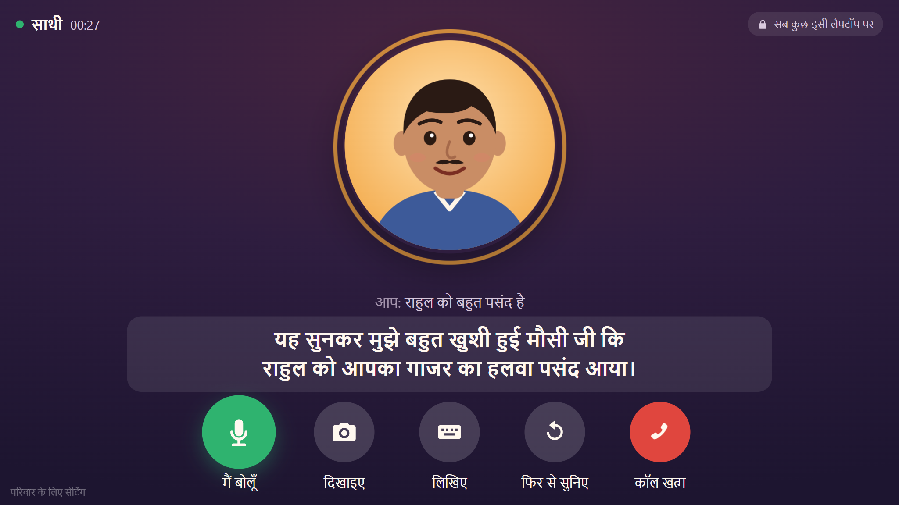
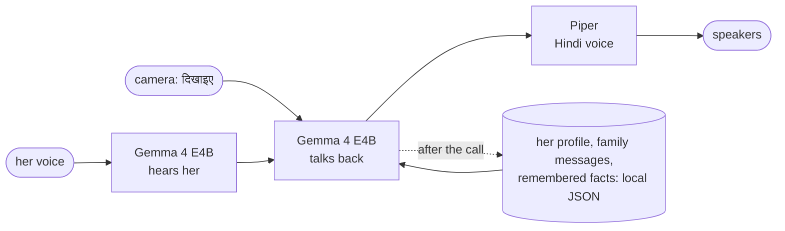
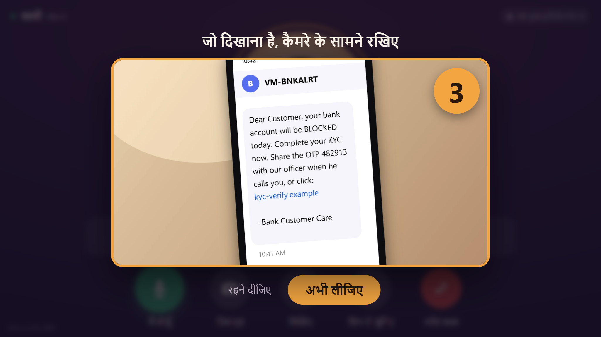
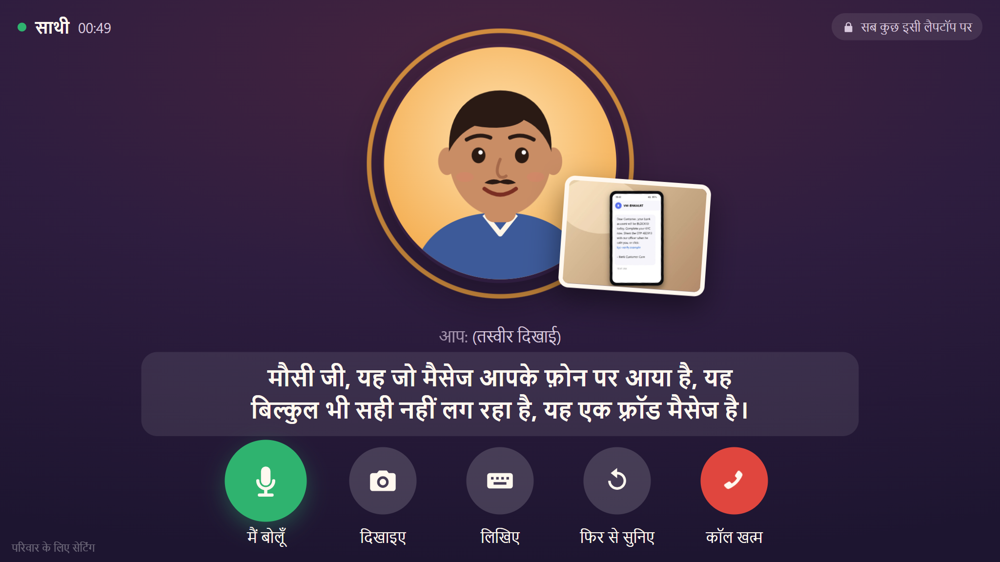
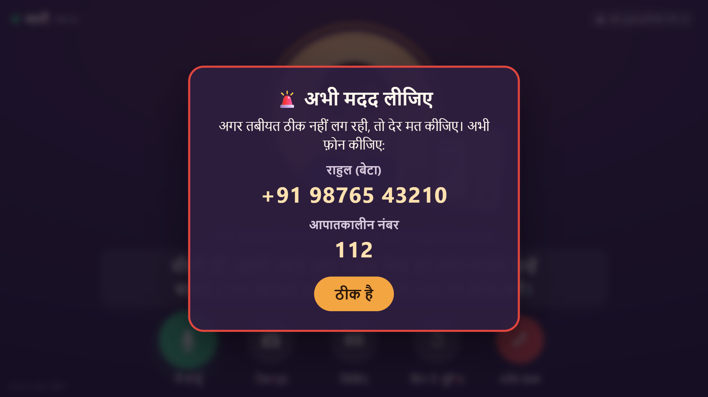
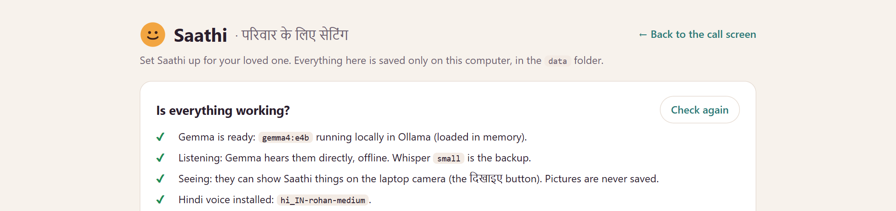

<p align="center"></p>

<h1 align="center">साथी · Saathi</h1>

<p align="center"><b>An offline Hindi video-call companion for someone you love.</b><br>
Gemma 4 hears her, sees what she holds up to the camera, and talks with her in everyday Hindi.<br>
All on her laptop: no accounts, no cloud, no monthly bill, and nothing leaves the house.</p>

<p align="center">
  
  
  
  
  
</p>



Saathi looks and feels like a video call: a friendly face, big buttons, and a voice that talks in everyday Hindi. It remembers what she told it last time, passes on messages from family, looks at whatever she holds up to the camera, and shows emergency numbers if something sounds wrong.

Built for the [DEV Hacktoberfest Weekend Challenge: Build for a Friend](https://dev.to/challenges/hacktoberfest-weekend-2026-10-01) (October 2–5, 2026).

---

## How it works

One open model, [Gemma 4](https://deepmind.google/models/gemma/), does all the understanding. It hears her, sees what she shows it, talks with her, and decides what to remember. Piper gives it a Hindi voice.



| Part | Open-source piece | Runs on |
|---|---|---|
| Listening | Gemma 4's own audio input, through [Ollama](https://ollama.com). Backup: [faster-whisper](https://github.com/SYSTRAN/faster-whisper) | this laptop |
| Seeing | Gemma 4's image input (the **दिखाइए** button) | this laptop |
| Thinking and remembering | [Gemma 4](https://deepmind.google/models/gemma/) `gemma4:e4b` served by [Ollama](https://ollama.com) | this laptop, GPU or CPU |
| Speaking | [Piper](https://github.com/OHF-Voice/piper1-gpl) with a Hindi voice | this laptop, CPU |
| App | Python + FastAPI, plain HTML/JS, no build step | this laptop |

### Things that make it feel like a call, not a chatbot
- **Hands-free.** After Saathi speaks, it starts listening by itself and notices when she has finished talking. She never has to touch a key.
- **Starts talking quickly.** Gemma's reply streams in; each finished sentence is spoken straight away instead of waiting for the whole answer.
- **"दिखाइए" (show me).** She presses the camera button and holds something up: the dish she cooked, a photo of the grandchildren, a letter. The picture is taken by itself after a 5-second countdown, so she can use both hands. Gemma says what it sees and asks about it, and the photo stays pinned beside the face while they talk, like a picture shared in a video call.
- **A face that talks.** The mouth moves with the loudness of the voice, the eyes blink, and the ring around the face shows whether Saathi is speaking, thinking or listening.
- **Big and simple.** Five large buttons with Hindi labels: बोलिए (speak), दिखाइए (show), लिखिए (type), फिर से सुनिए (repeat), कॉल खत्म (end call). Large Devanagari subtitles for everything.
- **Ready when she is.** Gemma starts loading the moment the window opens, and stays loaded while it is open. If she presses the button before it's ready, Saathi says "नमस्ते! बस एक मिनट, मैं आ रहा हूँ" instead of sitting silent.
- **It remembers.** After each call, Gemma picks out a few facts worth remembering ("मौसी जी के घुटने में दर्द था"). The next call opens by following up on one, health first: "कल रात आप बाथरूम में गिरी थीं, उस सब के बाद अब आप कैसी हैं?" Facts reach Gemma as "कल", "परसों", "पिछले हफ़्ते", because a small model gets raw dates wrong.
- **Messages from family.** Leave a note on the family page ("I'll video call you on Sunday at 7"), and Saathi passes it on in its own words at the start of the next call.
- **Correct Hindi grammar.** Saathi uses the right verb forms for her (कैसी हैं / कैसे हैं) and for itself (रही हूँ / रहा हूँ), depending on the face you pick.
- **One icon.** The first run puts a smiling-face **साथी** shortcut on the desktop.

### Safety, built in
- **Emergency card.** If she mentions chest pain, a fall, trouble breathing or fainting, the screen shows her emergency contact and the local emergency number in huge text. This is a plain keyword check that does not depend on the AI getting it right.
- **Scam card.** Mentions of OTPs, bank PINs, "KYC", AnyDesk or "digital arrest" show a warning not to share anything and to call family first. If she holds a suspicious SMS up to the camera, Gemma reads it, and the same card appears when its answer flags fraud.
- **Honest about what it is.** Saathi says it is a computer companion if asked, never gives medicine advice, and gently encourages her to call family and meet friends. It is told exactly what it can't do (play songs, make calls, set reminders), so it never offers. It is meant to keep her company between calls, not to replace anyone.

<table>
<tr>
<td width="50%"><br><sub><b>दिखाइए:</b> she holds something up; the picture is taken by itself.</sub></td>
<td width="50%"><br><sub>Gemma reads it, says it's a fraud, and the scam card appears.</sub></td>
</tr>
<tr>
<td width="50%"><br><sub>She mentions a fall: the emergency card, and Saathi says "call Rahul or 112 now".</sub></td>
<td width="50%"><br><sub>The family page checks everything works offline.</sub></td>
</tr>
</table>

<sub>Screenshots are from a demo profile with made-up names and numbers. The SMS is a made-up example.</sub>

---

## What you need

- Windows 10/11, Linux or macOS
- 16 GB RAM recommended (8 GB works with `gemma4:e2b`)
- About 10–15 GB of free disk space
- [Python 3.10–3.12](https://www.python.org/downloads/) (on Windows, tick **"Add python.exe to PATH"** when installing)
- [Ollama](https://ollama.com/download)
- Microsoft Edge or Google Chrome (for the call window)
- A microphone and speakers, and a webcam for **दिखाइए** (any laptop's built-in ones are fine)
- Internet **once**, for the downloads. After that, unplug it.

## Set it up (once, with internet)

1. **Install Ollama** from https://ollama.com/download and open it once. It keeps running quietly in the background.
2. **Get this folder** (download the ZIP from GitHub and unzip it, or `git clone`).
3. **Windows:** double-click `start.bat`.
   **Linux/macOS:** run `./start.sh` in a terminal.

   The first run creates a Python environment, installs everything, then downloads Gemma, the Hindi voice and Whisper (the backup ears). This takes a while (Gemma is several GB). On Windows it also puts a **साथी** shortcut on the desktop. When it finishes, the call window opens.
4. **Open the family page** (small link at the bottom-left, or http://127.0.0.1:8765/family). Fill in her name, how Saathi should address her (मौसी जी, बुआ जी, चाचा जी…), family members (names in Hindi, so the voice says them right), interests and the emergency contact. Press **Save**.
5. Press **बोलिए** and **दिखाइए** once each and allow the microphone and camera when the browser asks, so she never sees those prompts.
6. Turn off the Wi-Fi and try a call. It should work exactly the same.

<details>
<summary>Manual setup (if you prefer the terminal)</summary>

```bash
python -m venv .venv
# Windows: .venv\Scripts\activate      Linux/macOS: source .venv/bin/activate
pip install -r requirements.txt
python scripts/setup.py                  # downloads Gemma (via Ollama), Whisper, Hindi voice
python scripts/setup.py --shortcut       # Windows: the साथी desktop shortcut
python server.py --open                  # http://127.0.0.1:8765
```
</details>

## Every day

Double-click **साथी** on the desktop, then press the big green **बात शुरू करें** button. That's it.

## Choosing the Gemma model

Change it on the family page (Advanced), or run `python scripts/setup.py --model <tag>`.

| Ollama tag | Hears her | Sees | When to use it |
|---|---|---|---|
| `gemma4:e2b` | yes | yes | Older laptops, or no graphics card. Fastest, simplest Hindi. |
| `gemma4:e4b` | yes | yes | **Default.** Good Hindi; comfortable on a laptop with a modern GPU or 16 GB RAM. |
| `gemma4:12b` | no (Whisper listens) | yes | The most natural Hindi; needs a big graphics card. |

The family page's "Is everything working?" box shows what the chosen model can do.

## How fast is it?

Measured on the laptop it was built on (RTX 5060 Laptop GPU 8 GB, Core Ultra 9, 16 GB RAM), `gemma4:e4b`, with the model already loaded:

| Step | Time |
|---|---|
| Gemma hears a 5-second sentence (Whisper `small` on CPU took 4.4 s) | 1.6–3.5 s |
| Gemma's first words of a reply | 0.8–1.9 s |
| Piper speaks a sentence | 0.35 s |
| Gemma looks at a photo and answers | about 3 s |
| Loading Gemma into memory | up to about 28 s (1.3 s when it had been loaded recently) |

Your machine will differ; on a laptop without a GPU, use `gemma4:e2b`.

## Hindi voices

| Voice | Sounds like |
|---|---|
| `hi_IN-rohan-medium` | male (default; matches the "Bhaiya" face) |
| `hi_IN-pratham-medium` | male |
| `hi_IN-priyamvada-medium` | female (pair it with the "Didi" face) |

`python scripts/setup.py --all-voices` downloads all three so you can compare them with the **Hear the voice** button. Samples: https://rhasspy.github.io/piper-samples/

If no Piper voice is installed, Saathi falls back to the browser's own Hindi voice (if the computer has one), and always shows subtitles.

## Privacy

Everything Saathi keeps is in the `data/` folder as readable JSON:

- `settings.json`: the profile you filled in
- `history.json`: recent conversation (only the last few hours are used in a call)
- `memories.json`: the facts it remembers (view and delete them on the family page)
- `family_messages.json`: your notes to her

Pictures from **दिखाइए** go to Gemma for that one reply and are never saved; the history only notes "(कैमरे पर कुछ दिखाया)". The camera turns off as soon as the picture is taken. Recordings of her voice are deleted as soon as they've been heard.

Delete the folder and Saathi forgets everything. The server only listens on `127.0.0.1`, so other devices on the network can't reach it.

## Troubleshooting

| Problem | Fix |
|---|---|
| "Ollama is not running" | Open the Ollama app, then reload the call window. |
| Model not downloaded | `ollama pull gemma4:e4b` or `python scripts/setup.py` |
| The first call takes a while to start | Gemma is loading (up to about 30 s). The start screen says "तैयार हो रहे हैं…" until it's ready. It then stays loaded while the window is open, plus 30 minutes (Advanced → "Keep Gemma loaded"). |
| Saathi can't hear her | Check the browser allowed the microphone (lock icon in the address bar). On the family page, try "Who listens: Whisper". |
| It cuts her off mid-sentence | She can press the green button again, or speak a little louder. The pause it waits for is `END_SILENCE_MS` in `web/call.js`. |
| No **दिखाइए** button | The laptop has no camera, or the model can't see pictures. The family page says which. |
| Replies are slow | Use `gemma4:e2b`, and keep the call window open so the model stays loaded. |
| Whisper on an NVIDIA GPU | Set "Listening runs on" to NVIDIA GPU (needs CUDA 12 + cuDNN). If it fails, Saathi falls back to CPU. |

## Tests

```bash
pip install pytest
python -m pytest -q
```

18 tests run the real server against a small fake Ollama (`tests/fake_ollama.py`). They cover streaming replies, greetings with family messages, memory extraction, relative dates and the greeting's follow-up, Gemma hearing a recording (resampled to 16 kHz), a camera picture that triggers the scam card and is never stored, warm-up using the same settings as chat, the emergency and scam cards, and the friendly errors when Ollama or the model is missing.

## Credits and licences

- Saathi's code: MIT (see `LICENSE`).
- [Gemma 4](https://deepmind.google/models/gemma/) by Google DeepMind: Apache 2.0.
- [Ollama](https://github.com/ollama/ollama): MIT.
- [faster-whisper](https://github.com/SYSTRAN/faster-whisper): MIT; [Whisper](https://github.com/openai/whisper) weights by OpenAI: MIT. [PyAV](https://github.com/PyAV-Org/PyAV) (decodes the browser's audio): BSD.
- [Piper](https://github.com/OHF-Voice/piper1-gpl) (`piper-tts`): GPL-3.0. Saathi uses it as a separately installed package.
- Piper Hindi voices: each voice has its own model card and dataset licence in [rhasspy/piper-voices](https://huggingface.co/rhasspy/piper-voices). Some are trained on non-commercial data (e.g. CC BY-NC-SA). Saathi is a personal, non-commercial project; check the model card before any other use.
- [FastAPI](https://github.com/fastapi/fastapi): MIT.

Built with help from an AI coding assistant (Claude).

The repository was created and the project built during the challenge window (October 2–5, 2026). Any commits after the submission deadline are listed below.

### Changes after the deadline
- _(none yet)_
